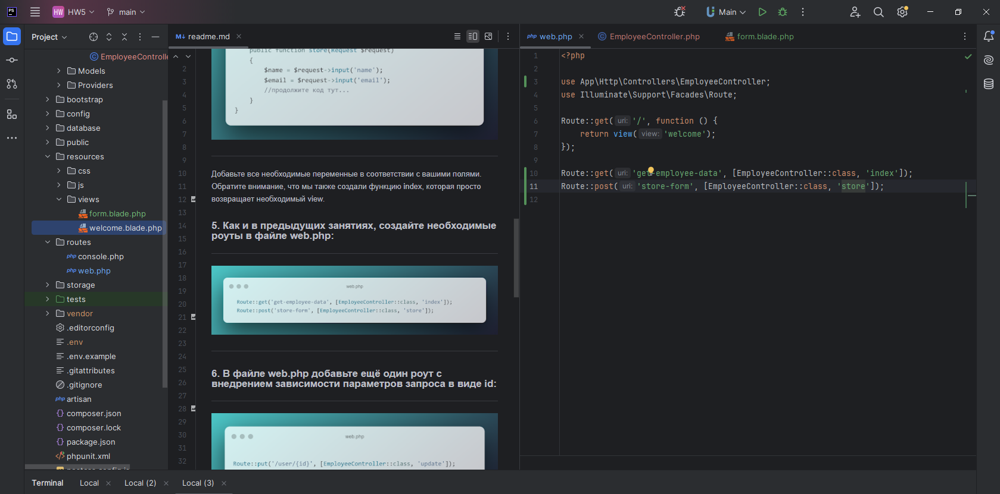

# Продвинутое программирование на PHP — Laravel
## Домашняя работа №5

### 1. В соответствующих каталогах создайте три файла:
    — blade-шаблон для создания пользовательских инпутов;
    — EmployeeController для обработки полученных данных из полей формы;
    — Route для создания динамического роутинга для отдельного работника и передачи параметра id из адресной строки.

### 2. В blade-шаблоне создайте форму, которая будет отправлять данные о работнике.

---

---

По аналогии с приведённым выше примером создайте ещё несколько полей ввода. Например, поля «Фамилия работника», «Занимаемая должность» и «Адрес проживания». Обратите внимание, что у всех полей формы есть атрибут required=”true”. Это важно для полноты получаемых данных от клиента к серверу.

---

---

### 3. Создайте новый контроллер с названием EmployeeController. Напомним, что создавать контроллер нужно из консоли с помощью команды:

---

---

---

### 4. Внутри контроллера создайте функцию store, которая будет инициализировать соответствующие переменные и сохранять в них данные из вашей формы:

---

---

---

Добавьте все необходимые переменные в соответствии с вашими полями. Обратите внимание, что мы также создали функцию index, которая просто возвращает необходимый view.

### 5. Как и в предыдущих занятиях, создайте необходимые роуты в файле web.php:

---

---

---

### 6. В файле web.php добавьте ещё один роут с внедрением зависимости параметров запроса в виде id:

---

---

---

### 7. Добавьте соответствующий метод в созданный ранее контроллер:

---

---

---
Добавьте новую переменную id. Поместите в неё id из параметров запроса, обновите данные о пользователе: name, email и так далее.

### 8. Создайте две новые функции getPath(), getUrl(), в которых необходимо получить и записать в переменную путь и URL запроса. Для этого воспользуйтесь встроенными в класс Request методами $request->path() и $request->url();

Данные методы можно вызывать внутри других методов — update и store, чтобы получать служебную информацию о запросе.

---

---

### 9. В форму ввода добавьте новое текстовое поле textarea, куда необходимо передавать данные в формате JSON, например:

---

---

---

### 10. Обновите функции store и update. Преобразуйте полученный из запроса JSON в переменную PHP. Для этого воспользуйтесь методом json_decode().

---

---

---

### 11. Создайте произвольное количество новых php переменных, в которые поместите отдельные поля из пришедших данных в формате JSON. Например:

---

---

---

---

